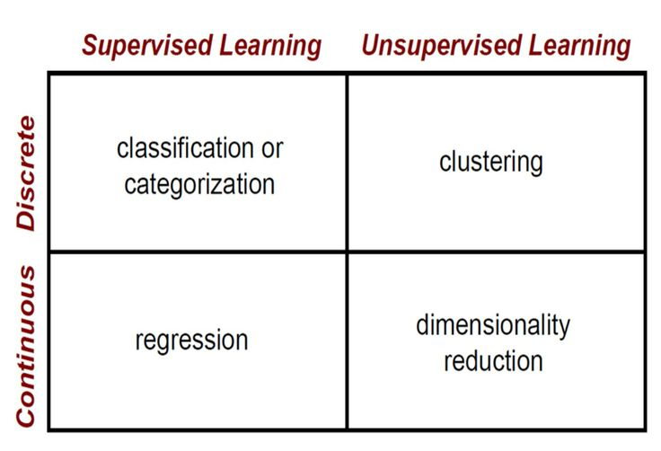
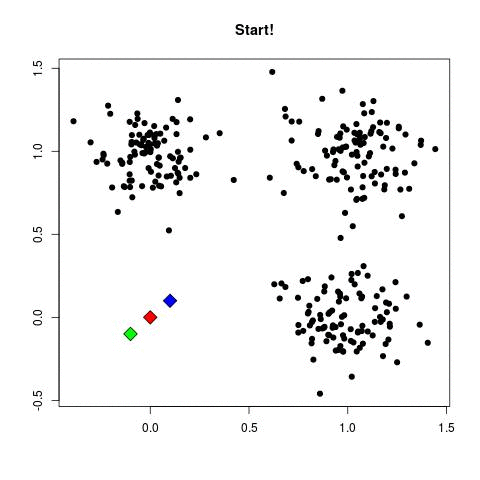
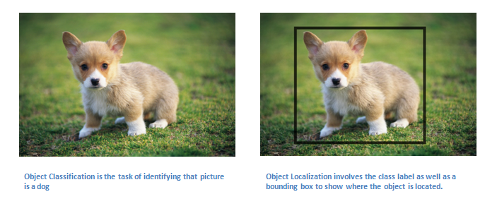
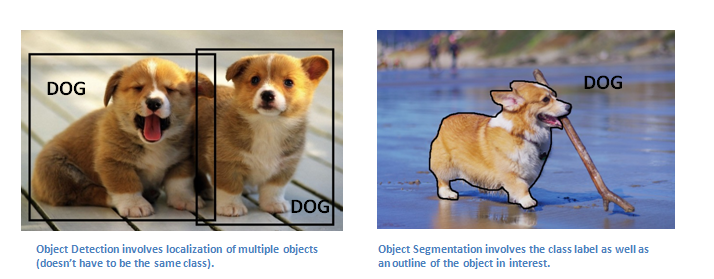

# TrueBlue Talks: Machine Learning

First introductory talk about machine learning in TrueBlue.

Pre-requisites:
 - Python basic knowledge
 - Conda installed
 - Would be nice if everyone has the environment already installed, it takes time

Please watch the intro at [ML-Tour](https://sabau.github.io/ml-tour/)

## AI - ML - DL How they are related

  

## Machine Learning Problems

  

## What we will see today

### Unsupervised exmaple: kNN

It's one of the most easy to understand algorithm, and gives satisfaction!

  

### Supervised exmaple: images

#### What are we trying to solve

  
  

#### Our dataset

  

